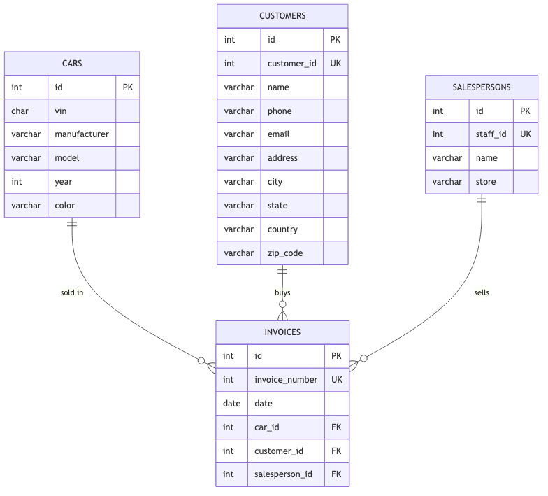

# Day 1 — Databases & Data Modelling

My notes on what a database actually is, how relational data gets
modelled, and the basics of SQL + MySQL Workbench.

---

## Databases, the short version

- **Database** — an organized collection of data, stored so it can be
  reliably accessed, managed, and updated.
- **DBMS** (Database Management System) — the software that actually does
  that (MySQL, PostgreSQL, SQLite, ...). "MySQL" is a DBMS; the database
  itself is whatever you create inside it.
- **Relational database** — organizes data into **tables** (rows =
  records, columns = attributes), where tables can be linked to each other
  via shared keys. This is what SQL is built around.

### Primary keys and foreign keys

- **Primary key (PK)** — uniquely identifies each row in a table. No two
  rows share one, and it can't be `NULL`.
- **Foreign key (FK)** — a column in one table that references another
  table's primary key, creating the actual *link* between them. This is
  what makes a `JOIN` possible, and what a database enforces to stop
  "orphan" rows (e.g. an invoice pointing at a car that doesn't exist).

**Auto-increment ID vs business ID:** worth keeping these separate,
learned directly from the lab. A table's `id` (`AUTO_INCREMENT PRIMARY
KEY`) is an internal, database-generated identifier — never something a
person types in or that carries real-world meaning. A "business" ID (a
car's VIN, a customer's `customer_id`, a staff badge number) is a
*different* column, one the outside world actually uses, usually with its
own `UNIQUE` constraint but not necessarily the primary key. Keeping them
separate means the internal ID never has to change even if the business
ID's format changes down the line.

### Relationship types

- **One-to-one** — one row in A matches exactly one row in B.
- **One-to-many** — one row in A can match many rows in B (e.g. one
  `salesperson` → many `invoices`), but each row in B points to only one
  row in A. The FK lives on the "many" side.
- **Many-to-many** — rows on both sides can match multiple rows on the
  other. Needs a third "junction" table in between, holding a FK to each
  side (can't be expressed with a single FK column).

### Data modeling / ERDs

An **Entity-Relationship Diagram (ERD)** is the visual version of a schema
design: boxes for tables (entities), listing their columns (attributes)
and key type, with lines between boxes showing the relationships and their
cardinality (`||` one, `o{` many, etc.).

MySQL Workbench can do this two ways:
- **Forward engineering** — draw the ERD first, generate the `CREATE
  TABLE` SQL from it.
- **Reverse engineering** — point it at an existing database, get the ERD
  generated automatically from what's already there.

### Data Warehouse vs Data Mart vs Data Lake

- **Data Warehouse** — structured, cleaned, integrated data from multiple
  sources, organized for company-wide analysis and reporting.
- **Data Mart** — a smaller, focused subset of a warehouse, scoped to one
  team/department (e.g. just Sales data).
- **Data Lake** — raw data in its original format (structured *and*
  unstructured), stored cheaply at scale, structured later only when
  there's an actual use for it — the opposite order from a warehouse.
- **ETL vs ELT** — Extract-Transform-Load cleans/shapes data *before*
  loading it in (typical for a warehouse); Extract-Load-Transform loads
  the raw data first and transforms it later, on demand (typical for a
  lake, since storage is cheap and the eventual use isn't known yet).

---

## SQL basics + MySQL Workbench

**SQL** (Structured Query Language) — the language for interacting with a
relational database: creating structure, and storing/retrieving/modifying
the data inside it.

### The four sublanguages

| | Stands for | Does | Example commands |
|---|---|---|---|
| **DDL** | Data Definition Language | defines the *structure* | `CREATE`, `ALTER`, `DROP`, `TRUNCATE`, `RENAME` |
| **DML** | Data Manipulation Language | works with the *data* itself | `SELECT`, `INSERT`, `UPDATE`, `DELETE` |
| **DCL** | Data Control Language | permissions/access control | `GRANT`, `REVOKE` |
| **TCL** | Transaction Control Language | groups statements into one all-or-nothing unit | `COMMIT`, `ROLLBACK` |

(DCL/TCL noted for completeness — not used day-to-day in this course.)

### Creating things

```sql
CREATE DATABASE IF NOT EXISTS my_db;
USE my_db;

CREATE TABLE IF NOT EXISTS my_table (
    id INT PRIMARY KEY,
    name VARCHAR(50) NOT NULL
);
```

`IF NOT EXISTS` makes the statement safe to re-run — without it, trying to
create something that's already there is an error, not a no-op.

### Modifying data

```sql
INSERT INTO my_table (id, name) VALUES (1, 'Ana'), (2, 'Marc');

UPDATE my_table SET name = 'Marc Antoni' WHERE id = 2;

DELETE FROM my_table WHERE id = 2;
```

**The one rule that actually matters here: never omit `WHERE`.**
`UPDATE`/`DELETE` without a `WHERE` clause applies to *every row in the
table*, not just one. If MySQL Workbench blocks this with a "safe update
mode" error, `SET SQL_SAFE_UPDATES = 0;` turns that guard rail off — worth
turning it back on (`= 1`) right after, not leaving it off for the rest of
the session.

### Running SQL

- **Terminal**: `mysql -u [username] -p`, then type queries directly, or
  `mysql -u [username] -p [db_name] < file.sql` to run a whole `.sql` file
  at once without opening an interactive session.
- **MySQL Workbench**: paste/write the query, click the lightning-bolt icon
  to run it (either the whole script, or just a highlighted portion).
  Results show as a grid for `SELECT`, or a row-count message for
  `INSERT`/`UPDATE`/`DELETE`.

---

## Lab | MySQL Database Creation

Designed and built a small database for a car dealership — `cars`,
`customers`, `salespersons`, `invoices` — then seeded it with sample data
and ran an update + a cleanup delete.



- **Auto-increment `id`** as the primary key on every table, kept separate
  from the natural business identifier (`vin`, `customer_id`, `staff_id`,
  `invoice_number`).
- **`invoices`** is the many-to-one hub — each invoice has exactly one
  `car_id`/`customer_id`/`salesperson_id` FK, while each car/customer/
  salesperson can appear on multiple invoices.
- **`vin` is deliberately *not* `UNIQUE`** in this schema — the seed data
  ships with a duplicate VIN on purpose, so the bonus challenge has a real
  duplicate to find and clean up. A real dealership schema would enforce
  this at the database level; here it's left to be caught downstream,
  which is the point of the exercise.
- **The bonus delete instructions had a real inconsistency**, worth
  documenting rather than silently working around: they say to remove
  "car ID #4" as the fix for the duplicate VIN, but in this schema id 4 is
  the Toyota RAV4 — the actual duplicate rows are id 5 and 6. Deleting by
  the literal ID would've removed an unrelated car and left the real
  duplicate in place, so `delete.sql` instead deletes by matching the VIN
  and keeping the lowest id — the version of the fix that matches the
  *stated reason* for deleting something.
- **Verified end-to-end against a real local MySQL instance** (not just
  written and assumed correct): ran `create.sql` → `seeding.sql` →
  `update.sql` → `delete.sql` in order, checked the actual table contents
  after each step, and confirmed the foreign keys are genuinely enforced
  (inserting an invoice with a nonexistent `car_id` correctly fails with a
  FK constraint error).

Solved here: [create.sql](create.sql), [seeding.sql](seeding.sql),
[update.sql](update.sql), [delete.sql](delete.sql)
(submitted via PR from [lab-sql-mysql-db-creation](https://github.com/aroaxinping/lab-sql-mysql-db-creation), required for the Student Portal to mark it as done)
